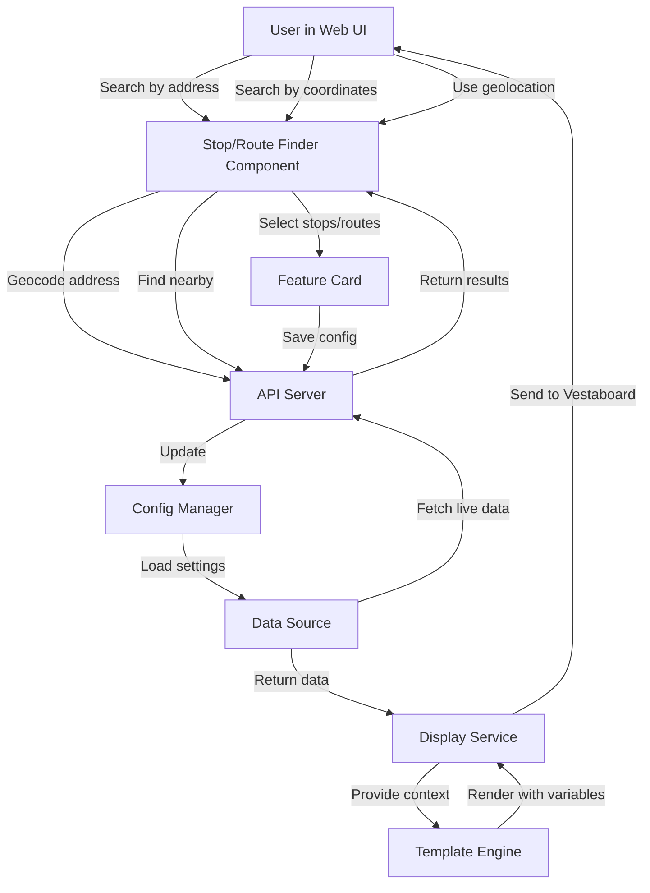
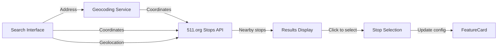
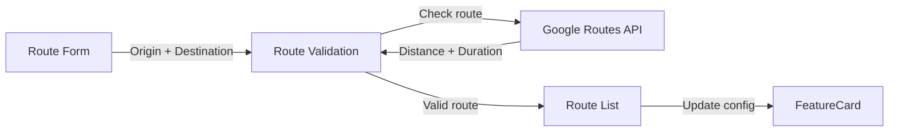

# Multi-Stop/Route Architecture

This document describes the architecture of the MUNI and Traffic multi-stop/route features.

## Data Flow



## Component Architecture

### MUNI Stop Finder



**Features:**
- Search by address (geocoded via Nominatim)
- Search by coordinates
- Search by current location (geolocation API)
- Visual display of stops with routes
- Up to 4 stops selectable
- Live route information displayed

### Traffic Route Planner



**Features:**
- Origin input with geolocation button
- Destination input
- Display name (e.g., "WORK", "AIRPORT")
- Route validation before adding
- Visual route management
- Up to 4 routes supported

## Template Variable Structure

### MUNI Variables

```
muni
├── stops[]                    # Array of stop data
│   ├── [0]
│   │   ├── stop_code         # "15726"
│   │   ├── line              # "N-JUDAH"
│   │   ├── stop_name         # "Church & Duboce"
│   │   ├── formatted         # "N: 3, 8, 15 min"
│   │   └── is_delayed        # true/false
│   ├── [1]
│   │   └── ...
│   └── [2-3]
│       └── ...
├── stop_count                 # 3
├── line                       # "N-JUDAH" (first stop)
├── stop_name                  # "Church & Duboce" (first stop)
└── formatted                  # "N: 3, 8, 15 min" (first stop)
```

**Template Usage:**
```
{{muni.stops.0.formatted}}     # First stop
{{muni.stops.1.line}}          # Second stop line
{{muni.stop_count}}            # Total stops
{{muni.formatted}}             # Backward compat (first stop)
```

### Traffic Variables

```
traffic
├── routes[]                   # Array of route data
│   ├── [0]
│   │   ├── origin            # "123 Main St"
│   │   ├── destination       # "456 Market St"
│   │   ├── destination_name  # "WORK"
│   │   ├── duration_minutes  # 25
│   │   ├── delay_minutes     # 5
│   │   ├── traffic_status    # "MODERATE"
│   │   └── formatted         # "WORK: 25m (+5m)"
│   ├── [1]
│   │   └── ...
│   └── [2-3]
│       └── ...
├── route_count                # 3
├── duration_minutes           # 25 (first route)
├── delay_minutes              # 5 (first route)
├── traffic_status             # "MODERATE" (first route)
├── destination_name           # "WORK" (first route)
└── formatted                  # "WORK: 25m (+5m)" (first route)
```

**Template Usage:**
```
{{traffic.routes.0.formatted}}        # First route
{{traffic.routes.1.duration_minutes}} # Second route duration
{{traffic.route_count}}               # Total routes
{{traffic.formatted}}                 # Backward compat (first route)
```

## Config Structure

### MUNI Config (New Format)

```json
{
  "muni": {
    "enabled": true,
    "api_key": "...",
    "stop_codes": ["15726", "15727", "15728"],
    "stop_names": ["Church & Duboce", "Market & Church", "Castro Station"],
    "line_name": "",
    "refresh_seconds": 60
  }
}
```

### MUNI Config (Old Format - Still Works)

```json
{
  "muni": {
    "enabled": true,
    "api_key": "...",
    "stop_code": "15726",
    "line_name": "N"
  }
}
```

### Traffic Config (New Format)

```json
{
  "traffic": {
    "enabled": true,
    "api_key": "...",
    "routes": [
      {
        "origin": "123 Main St, SF",
        "destination": "456 Market St, SF",
        "destination_name": "WORK"
      },
      {
        "origin": "123 Main St, SF",
        "destination": "SFO Airport",
        "destination_name": "AIRPORT"
      }
    ],
    "refresh_seconds": 300
  }
}
```

### Traffic Config (Old Format - Still Works)

```json
{
  "traffic": {
    "enabled": true,
    "api_key": "...",
    "origin": "123 Main St, SF",
    "destination": "456 Market St, SF",
    "destination_name": "DOWNTOWN"
  }
}
```

## API Endpoints

### MUNI Endpoints

| Endpoint | Method | Description |
|----------|--------|-------------|
| `/muni/stops` | GET | List all Muni stops (cached 24hr) |
| `/muni/stops/nearby` | GET | Find stops near coordinates |
| `/muni/stops/search` | GET | Find stops near an address |

### Traffic Endpoints

| Endpoint | Method | Description |
|----------|--------|-------------|
| `/traffic/routes/geocode` | POST | Geocode an address to coordinates |
| `/traffic/routes/validate` | POST | Validate a route and get estimates |

## Migration Strategy

**Automatic Migration:**
- When users save settings in the new UI, old configs automatically migrate
- Single stop/route becomes index 0 in the array
- Backward compatibility fields maintained

**No Breaking Changes:**
- Existing templates continue to work
- Old config format still supported
- Users can gradually adopt new features

## Implementation Pattern

This implementation follows the same pattern as BayWheels:

1. **Backend API** - Search/discovery endpoints
2. **Data Source** - Multi-item support with backward compatibility
3. **Config** - Array storage with migration
4. **Templates** - Indexed access with fallback to first item
5. **Frontend** - Visual finder/planner component
6. **Integration** - Feature card integration
7. **Variable Picker** - Live accordion with indexes

This pattern can be reused for future multi-item features (e.g., multiple weather locations, multiple Home Assistant entities, etc.).

