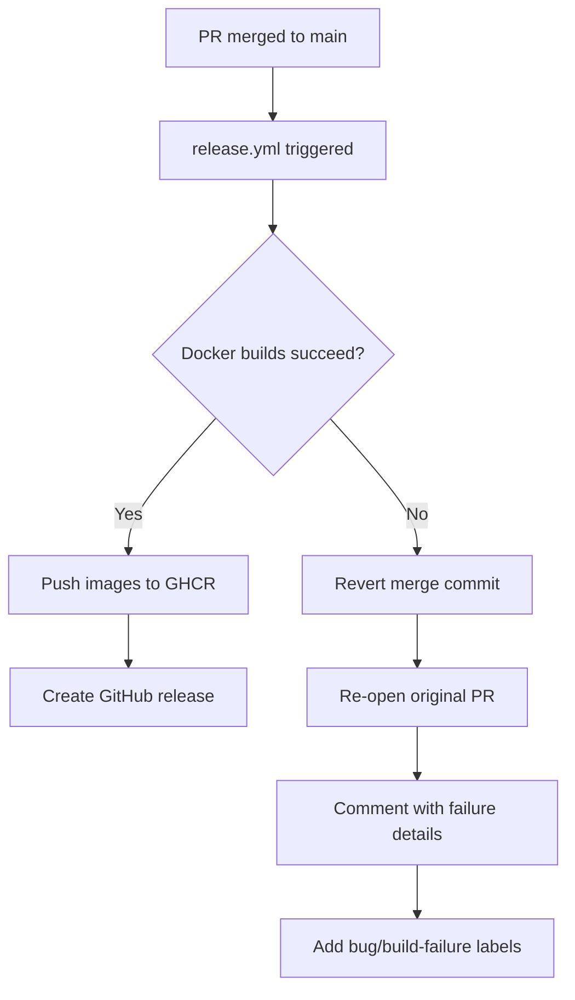

# CI/CD Approach - Fast PRs, Safe Main

## Philosophy

Our CI/CD approach prioritizes **developer velocity** while maintaining **production safety** through automatic rollback:

- ✅ **Fast PR checks** - Only run essential tests (Python imports, unit tests, linting)
- ✅ **No Docker builds on PRs** - Skip time-consuming Docker builds to speed up feedback
- ✅ **Safe main branch** - Full Docker builds only on `main` after merge
- ✅ **Automatic rollback** - If Docker builds fail on `main`, automatically revert and re-open PR

## The Strategy

### On Pull Requests (`.github/workflows/ci.yml`)

**What runs:**
- Python import verification
- Unit tests (pytest)
- Linting (pylint)
- Basic syntax checks
- Web UI tests (vitest)

**What doesn't run:**
- ❌ Docker builds (too slow, ~10 minutes)
- ❌ Docker image tests

**Why:** Most issues are caught by tests and linting. Docker build failures are rare and don't warrant slowing down every PR.

### On Main Branch (`.github/workflows/release.yml`)

**What runs:**
1. Automatic version bump based on PR labels
2. Full Docker image builds (API + UI)
3. Push images to GHCR with version tags
4. Create GitHub release

**If builds fail:**
1. 🚨 Automatically revert the merge commit
2. 🔓 Re-open the original PR
3. 💬 Comment on PR with failure details and build logs
4. 🏷️ Add `bug` and `build-failure` labels

**Why:** This approach is **more cost and time efficient**:
- Saves ~10 minutes per PR (no Docker builds)
- Failures are rare, and automatic rollback catches them
- PR authors get immediate notification to fix issues
- Main branch is always in a working state

## Workflows

### 1. `ci.yml` - Pull Request CI
- **Triggers:** Pull requests to `main` or `develop`
- **Duration:** ~2-3 minutes
- **Jobs:**
  - `test` - Python tests, imports, linting
  - `test-ui` - Web UI tests
  - `build` - Package structure verification

### 2. `release.yml` - Release and Docker Build
- **Triggers:** Push to `main` branch
- **Duration:** ~10-15 minutes
- **Jobs:**
  - Bump version based on PR labels
  - Build and push Docker images
  - Create GitHub release
  - **On failure:** Automatic revert + re-open PR

### 3. ~~`publish-images.yml` - Development Images~~ (REMOVED)
- This workflow has been removed
- **Reason:** We only publish images from `main` on version bumps
- **For testing:** Build Docker images locally or wait for merge to main

### 3. `pr-label.yml` - Automatic PR Labeling
- **Triggers:** PR opened, edited, or synchronized
- **Duration:** ~5 seconds
- **Jobs:**
  - Auto-label PRs based on conventional commit titles
  - Labels: `major`, `minor`, `patch`

## Version Bumping

Versions are automatically bumped based on PR title using conventional commits:

| PR Title Format | Label | Version Bump | Example |
|-----------------|-------|--------------|---------|
| `feat: ...` or `feature: ...` | `minor` | 1.1.0 → 1.2.0 | New features |
| `fix: ...` | `patch` | 1.1.0 → 1.1.1 | Bug fixes |
| `BREAKING CHANGE:` or `!:` | `major` | 1.1.0 → 2.0.0 | Breaking changes |
| Other (e.g., `chore:`, `docs:`) | `patch` | 1.1.0 → 1.1.1 | Everything else |

## Automatic Rollback Process

When a Docker build fails on `main`:



### What happens:

1. **Revert:** Main branch is force-pushed to the commit before the merge
2. **Re-open PR:** The original PR is automatically re-opened
3. **Notify:** A comment is added to the PR:
   ```
   ## 🚨 Docker Build Failed
   
   The merge to `main` has been automatically reverted because the Docker build failed.
   
   **Build logs:** [link to failed run]
   
   Please fix the Docker build issues and re-submit this PR.
   ```
4. **Label:** PR is labeled with `bug` and `build-failure`

### Why this is better:

**Old approach (PR Docker builds):**
- ⏱️ Every PR waits ~10 minutes for Docker builds
- 💰 More CI minutes consumed
- 🐌 Slower feedback loop for non-Docker issues

**New approach (automatic rollback):**
- ⚡ PRs get feedback in ~2-3 minutes
- 💰 Less CI minutes (only build on main)
- 🔄 Automatic recovery from rare build failures
- 🎯 Main branch always works

## Cost Analysis

Assuming:
- 20 PRs per week
- Docker build time: 10 minutes
- Old approach: All PRs build Docker images
- New approach: Only merged PRs (estimate 50% of PRs) build Docker images

### Old Approach
- 20 PRs × 10 minutes = **200 minutes/week**

### New Approach
- 10 merged PRs × 10 minutes = **100 minutes/week**
- 1 build failure/month × 10 minutes = **2.5 minutes/week**
- **Total: ~102.5 minutes/week**

**Savings: ~50% CI time and cost**

## Trade-offs

### Pros
- ✅ Much faster PR feedback (2-3 min vs 12-13 min)
- ✅ Lower CI costs (~50% reduction)
- ✅ Automatic recovery from build failures
- ✅ Main branch always in working state
- ✅ Clear notification when issues occur

### Cons
- ⚠️ Docker build failures discovered after merge (not before)
- ⚠️ Brief period (~10 min) where main might fail (before auto-revert)
- ⚠️ Requires force-push to main (but automated and safe)

### When this approach works well
- ✅ Small to medium teams
- ✅ Docker build failures are rare
- ✅ Most issues caught by tests/linting
- ✅ Fast iteration is valued

### When to reconsider
- ⚠️ Large team with many concurrent merges
- ⚠️ Frequent Docker build issues
- ⚠️ Cannot tolerate any main branch failures
- ⚠️ Downstream systems depend on main being always buildable

## Monitoring Build Health

Keep an eye on build failure rates:

```bash
# Check recent workflow runs
gh run list --workflow=release.yml --limit 20

# View failures
gh run list --workflow=release.yml --status=failure
```

If you see frequent Docker build failures (>5% of merges), consider:
1. Adding Docker builds back to PRs
2. Improving Docker build validation in tests
3. Adding pre-merge Docker build checks for specific file patterns

## Manual Docker Build Testing

If you want to test Docker builds before merging, you can:

### Option 1: Local Testing
```bash
# Test API build
docker build -f Dockerfile.api -t vesta-api:test .

# Test UI build
docker build -f Dockerfile.ui -t vesta-ui:test .
```

### Option 2: Manual Workflow Dispatch
- Go to Actions → "Release and Publish"
- Click "Run workflow"
- Select your branch
- Manually trigger a Docker build

## Best Practices

1. **Use conventional commit titles** - Ensures proper versioning
2. **Run local tests** - Before pushing PR
3. **Test Docker builds locally** - For Dockerfile changes
4. **Monitor workflow runs** - Check Actions tab after merge
5. **Fix quickly** - If auto-revert happens, fix and re-merge ASAP

## Summary

This CI/CD approach optimizes for **developer velocity** while maintaining **production safety**:

- Fast PR feedback (2-3 minutes)
- Lower CI costs (~50% reduction)
- Automatic rollback on failures
- Main branch always works

The key insight: **Docker build failures are rare, so don't slow down every PR for them. Instead, catch them on main and automatically revert.**

