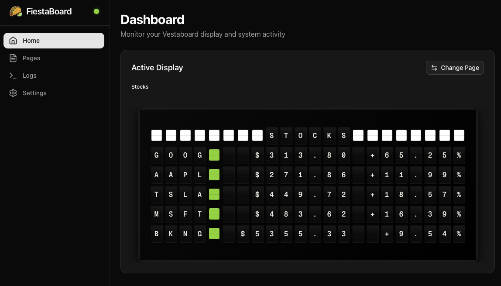
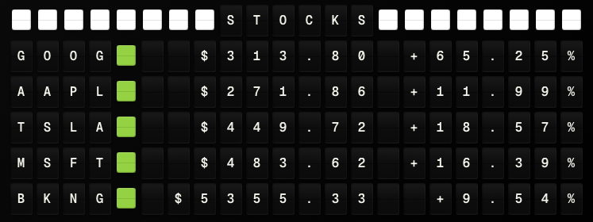

# FiestaBoard 

**Turn your split-flap display into a living dashboard.** FiestaBoard transforms your iconic split-flap display into a real-time information hub—track your morning commute, monitor the markets, check surf conditions, or display Star Trek wisdom. All beautifully formatted, endlessly customizable, and running in Docker with zero hassle.

Built for San Francisco life, but works anywhere.

## 🚀 TLDR - Quick Start

**Just want to get it running? Here's the fastest way:**

### Easiest: Use the Installation Script

```bash
# Mac/Linux
./scripts/install.sh

# Windows (PowerShell)
.\scripts\install.ps1
```

The script will guide you through everything! 🎉

### Manual Setup

```bash
# 1. Create .env file with your API keys
cp env.example .env
# Edit .env and add: BOARD_READ_WRITE_KEY and WEATHER_API_KEY

# 2. Run it! (first time builds images)
docker-compose up --build

# Or for subsequent runs (uses cached images)
docker-compose up
```

That's it! 🎉

**Access:**
- **Web UI**: http://localhost:8080 (start service, send messages, monitor)
- **API**: http://localhost:8000 (REST API endpoints)
- **API Docs**: http://localhost:8000/docs (interactive API documentation)



**To start the display service:**
1. Open http://localhost:8080 in your browser
2. Click "▶ Start Service" button
3. Your board will start updating!

**To stop:**
```bash
docker-compose down
```

**For development/testing:** Just run `docker-compose up` - it works great for local dev! See [LOCAL_DEVELOPMENT.md](./docs/setup/LOCAL_DEVELOPMENT.md) for more options.

---

## Features

FiestaBoard uses a **plugin architecture** - each feature is a self-contained plugin with its own documentation. Browse the `plugins/` directory or use the web UI's **Integrations** page to discover and enable plugins.

### Available Plugins
- 🌤️ **[Weather](./plugins/weather/docs/SETUP.md)**: Current weather conditions with text-based icons
- 📅 **[Date/Time](./plugins/datetime/README.md)**: Current date and time with timezone support
- 🏠 **[Home Assistant](./plugins/home_assistant/docs/SETUP.md)**: House status display (doors, garage, locks, etc.)
- 🖖 **[Star Trek Quotes](./plugins/star_trek_quotes/docs/SETUP.md)**: Random quotes from TNG, Voyager, and DS9
- 📶 **[Guest WiFi](./plugins/guest_wifi/docs/SETUP.md)**: Display WiFi credentials for guests
- 🚴 **[Bay Wheels](./plugins/baywheels/docs/SETUP.md)**: Track bike availability at multiple stations
- 🚇 **[Muni Transit](./plugins/muni/docs/SETUP.md)**: Real-time SF Muni arrival predictions
- 🚗 **[Traffic](./plugins/traffic/docs/SETUP.md)**: Travel time to destinations with live traffic
- 📈 **[Stocks](./plugins/stocks/docs/SETUP.md)**: Monitor stock prices with color-coded indicators
- 🌊 **[Surf Conditions](./plugins/surf/docs/SETUP.md)**: Live surf reports with wave height and quality ratings
- 💨 **[Air Quality & Fog](./plugins/air_fog/docs/SETUP.md)**: Monitor AQI and fog conditions
- ✈️ **[Flight Tracking](./plugins/flights/docs/SETUP.md)**: Display nearby aircraft with call signs and altitude
- 🌙 **Silence Schedule**: Configure quiet hours when the board won't update

**→ [Plugin Development Guide](./docs/development/PLUGIN_DEVELOPMENT.md)** - Create your own plugins!

### System Features
- 📄 **Page-Based Display**: Create and select pages via the web UI
- 🔄 **Configurable Update Interval**: Adjust how often the board checks for new content (10-3600 seconds)
- ⚡ **Smart Preview Caching**: Page previews are cached (5 min TTL) for fast UI rendering, while active displays always get fresh data
- 🐳 **Docker Ready**: Containerized for easy deployment on any system
- ⚙️ **Highly Configurable**: Environment-based configuration for all features
- 🔒 **Secure**: API token support for all integrations

---

## 👋 New to Technical Setup?

**Not comfortable with Docker or terminal commands?** We've got you covered! Check out our step-by-step beginner's guide that walks through everything in plain language.

**→ [Complete Beginner's Setup Guide](./docs/setup/BEGINNERS_GUIDE.md)**

---

## Quick Start (Detailed)

### Prerequisites

- Docker and Docker Compose installed
- Board Read/Write API key
- Weather API key (WeatherAPI.com recommended)
- (Optional) Home Assistant server with access token

### Basic Setup

1. **Clone or navigate to the project directory**

2. **Create `.env` file**:
   ```bash
   cp env.example .env
   ```

3. **Edit `.env` and add your API keys**:
   ```bash
   # Required
   BOARD_READ_WRITE_KEY=your_board_key_here
   WEATHER_API_KEY=your_weather_api_key_here
   WEATHER_PROVIDER=weatherapi
   WEATHER_LOCATION=San Francisco, CA
   TIMEZONE=America/Los_Angeles
   ```
   
   > **Note**: Plugins are enabled via the web UI's **Integrations** page, not environment variables. See each plugin's setup guide for API keys and configuration.

4. **Build and run with Docker Compose**:
   ```bash
   # First time (builds images)
   docker-compose up --build
   
   # Or run in background
   docker-compose up -d --build
   ```

5. **Access the services**:
   - **Web UI**: http://localhost:8080
   - **API**: http://localhost:8000
   - **API Docs**: http://localhost:8000/docs

6. **Start the display service**:
   - Open http://localhost:8080 in your browser
   - Click "▶ Start Service" button
   - Your board will begin updating!

7. **View logs**:
   ```bash
   docker-compose logs -f
   ```

### Advanced Setup

For detailed setup instructions for specific plugins, see each plugin's `docs/SETUP.md`:
- **Home Assistant**: [plugins/home_assistant/docs/SETUP.md](./plugins/home_assistant/docs/SETUP.md)
- **Weather**: [plugins/weather/docs/SETUP.md](./plugins/weather/docs/SETUP.md)
- **Stocks**: [plugins/stocks/docs/SETUP.md](./plugins/stocks/docs/SETUP.md)

Browse `plugins/*/docs/SETUP.md` for all plugin setup guides.

## Configuration

All configuration is done via environment variables in `.env`:

### Required

- `BOARD_READ_WRITE_KEY`: Your board Read/Write API key
- `WEATHER_API_KEY`: Your weather API key

### Core Configuration

- `WEATHER_PROVIDER`: `weatherapi` (default) or `openweathermap`
- `WEATHER_LOCATION`: Location string (default: "San Francisco, CA")
- `TIMEZONE`: Timezone name (default: "America/Los_Angeles")
- `REFRESH_INTERVAL_SECONDS`: Update frequency in seconds (default: 300 = 5 minutes)

### Plugin Configuration

All plugins can be configured via the web UI (**Integrations** page) or environment variables. Each plugin has its own setup documentation in `plugins/<plugin_name>/docs/SETUP.md`.

| Plugin | API Key Required | Setup Guide |
|--------|-----------------|-------------|
| Bay Wheels | No | [plugins/baywheels/docs/SETUP.md](./plugins/baywheels/docs/SETUP.md) |
| Muni Transit | Yes (free 511.org) | [plugins/muni/docs/SETUP.md](./plugins/muni/docs/SETUP.md) |
| Traffic | Yes (Google Routes) | [plugins/traffic/docs/SETUP.md](./plugins/traffic/docs/SETUP.md) |
| Stocks | No (optional Finnhub) | [plugins/stocks/docs/SETUP.md](./plugins/stocks/docs/SETUP.md) |
| Surf | No | [plugins/surf/docs/SETUP.md](./plugins/surf/docs/SETUP.md) |
| Air/Fog | Yes (PurpleAir/OWM) | [plugins/air_fog/docs/SETUP.md](./plugins/air_fog/docs/SETUP.md) |
| Flights | Yes (aviationstack) | [plugins/flights/docs/SETUP.md](./plugins/flights/docs/SETUP.md) |
| Star Trek Quotes | No | [plugins/star_trek_quotes/docs/SETUP.md](./plugins/star_trek_quotes/docs/SETUP.md) |
| Home Assistant | Yes (HA token) | [plugins/home_assistant/docs/SETUP.md](./plugins/home_assistant/docs/SETUP.md) |
| Guest WiFi | No | [plugins/guest_wifi/docs/SETUP.md](./plugins/guest_wifi/docs/SETUP.md) |

See `env.example` for all available environment variables.

## Local Development

### Docker Compose (Recommended)

```bash
# Build and run for development
docker-compose -f docker-compose.dev.yml up --build

# Access Web UI at http://localhost:3000
# Access API at http://localhost:8000
```

The development environment includes hot reload for both Python and Next.js code.

For detailed development workflows, see [LOCAL_DEVELOPMENT.md](./docs/setup/LOCAL_DEVELOPMENT.md).

## How It Works

Select a page in the web UI and the service will keep it updated on your board. Pages use templates with dynamic data sources like weather, time, and more. Create custom pages to display exactly what you want.

## Project Structure

```
FiestaBoard/
├── plugins/                        # Plugin-based data sources
│   ├── _template/                  # Template for new plugins
│   ├── weather/                    # Weather plugin
│   ├── stocks/                     # Stocks plugin
│   ├── muni/                       # Muni transit plugin
│   └── .../                        # Other plugins
├── src/                            # Platform core (API, display service)
│   ├── api_server.py               # FastAPI REST API
│   ├── main.py                     # Display service core
│   ├── config.py                   # Configuration management
│   ├── board_client.py             # Board API client
│   ├── plugins/                    # Plugin system infrastructure
│   └── formatters/                 # Message formatting
├── web/                            # Next.js web UI
│   └── src/                        # React components and pages
├── docs/                           # Documentation
│   ├── setup/                      # Setup guides
│   ├── development/                # Plugin development guide
│   ├── deployment/                 # Deployment guides
│   └── reference/                  # API research and reference
├── scripts/                        # Utility scripts
├── tests/                          # Platform test suite
├── Dockerfile.api                  # API service Dockerfile
├── Dockerfile.ui                   # Web UI Dockerfile
├── docker-compose.yml              # Production compose
├── docker-compose.dev.yml          # Development compose
└── .env                            # Environment variables
```

## API Keys

### Board API

1. Go to [web.vestaboard.com](https://web.vestaboard.com)
2. Navigate to API section
3. Enable Read/Write API
4. Copy your Read/Write API key

### Weather

**Recommended: WeatherAPI.com**
- Sign up at [weatherapi.com](https://www.weatherapi.com/)
- Free tier: 1 million calls/month
- No credit card required

**Alternative: OpenWeatherMap**
- Sign up at [openweathermap.org](https://openweathermap.org/)
- Free tier: 1,000 calls/day

## Deployment

### Local Development

```bash
# Build and start services
docker-compose up --build

# Run in background
docker-compose up -d --build

# Stop services
docker-compose down
```

See [LOCAL_DEVELOPMENT.md](./docs/setup/LOCAL_DEVELOPMENT.md) for detailed development workflows.

### Production Deployment

FiestaBoard supports multiple deployment options:

- **[Raspberry Pi](./docs/deployment/PI_BUILD_GUIDE.md)**: ARM-compatible builds
- **Docker Compose**: Use `docker-compose.yml` for production deployments

See deployment guides for detailed instructions.


## Troubleshooting

### API Key Errors

- Verify your `.env` file exists and contains valid keys
- Check that keys don't have extra spaces or quotes
- For the board: Ensure Read/Write API is enabled in your account

### Weather API Errors

- Verify your API key is correct
- Check API rate limits haven't been exceeded
- Ensure location string is valid

### Docker Issues

- Ensure Docker is running: `docker ps`
- Check container logs: `docker-compose logs`
- Verify `.env` file is readable

## Documentation

### Setup Guides
- **[Beginner's Guide](./docs/setup/BEGINNERS_GUIDE.md)**: Step-by-step setup for non-technical users
- **[Local Development](./docs/setup/LOCAL_DEVELOPMENT.md)**: Development environment setup
- **[Docker Setup](./docs/setup/DOCKER_SETUP.md)**: Docker configuration details
- **[Cloud API Setup](./docs/setup/CLOUD_API_SETUP.md)**: Production API configuration

### Plugin Documentation
Each plugin includes its own documentation:
- **Developer docs**: `plugins/<plugin>/README.md` - How the plugin works
- **Setup guide**: `plugins/<plugin>/docs/SETUP.md` - User-facing configuration

See **[Plugin Development Guide](./docs/development/PLUGIN_DEVELOPMENT.md)** to create your own plugins.

### Deployment Guides
- **[Raspberry Pi](./docs/deployment/PI_BUILD_GUIDE.md)**: Build on Raspberry Pi

### Reference
- **[API Research](./docs/reference/API_RESEARCH.md)**: API integration details
- **[Character Codes](./docs/reference/CHARACTER_CODES.md)**: Board character reference
- **[Color Guide](./docs/reference/COLOR_GUIDE.md)**: Color coding reference

## Future Features

- 🌐 Webhook support for manual messages
- 📸 Custom image display
- 📊 Analytics and usage stats

## License

MIT License - see [LICENSE](./LICENSE) file for details.

## Screenshots

The board can display various screens:

- **Weather + DateTime**: Current conditions with temperature and text-based weather icons
- **Home Assistant**: House status with green ([G]) and red ([R]) indicators
- **Star Trek Quotes**: Inspiring quotes from TNG, Voyager, and DS9
- **Guest WiFi**: SSID and password for guests
- **Stocks**: Monitor stock prices and percentage changes with color-coded indicators



**System Features:**
- **Silence Schedule**: Configure quiet hours when the board won't update (e.g., 8pm-7am)

## External Resources

- [Board API Docs](https://docs.vestaboard.com/docs/read-write-api/introduction)
- [WeatherAPI.com](https://www.weatherapi.com/)
- [OpenWeatherMap](https://openweathermap.org/api)
- [Home Assistant REST API](https://developers.home-assistant.io/docs/api/rest/)

## Support the Project

FiestaBoard is free and open source. If you find it useful and want to support continued development, consider buying me a coffee! ☕

<a href="https://www.buymeacoffee.com/fiestaboard" target="_blank"></a>

Your support helps maintain the project, add new features, and keep the documentation up to date. Every coffee is appreciated! 🙏

---
Made with ❤️ in San Francisco.
