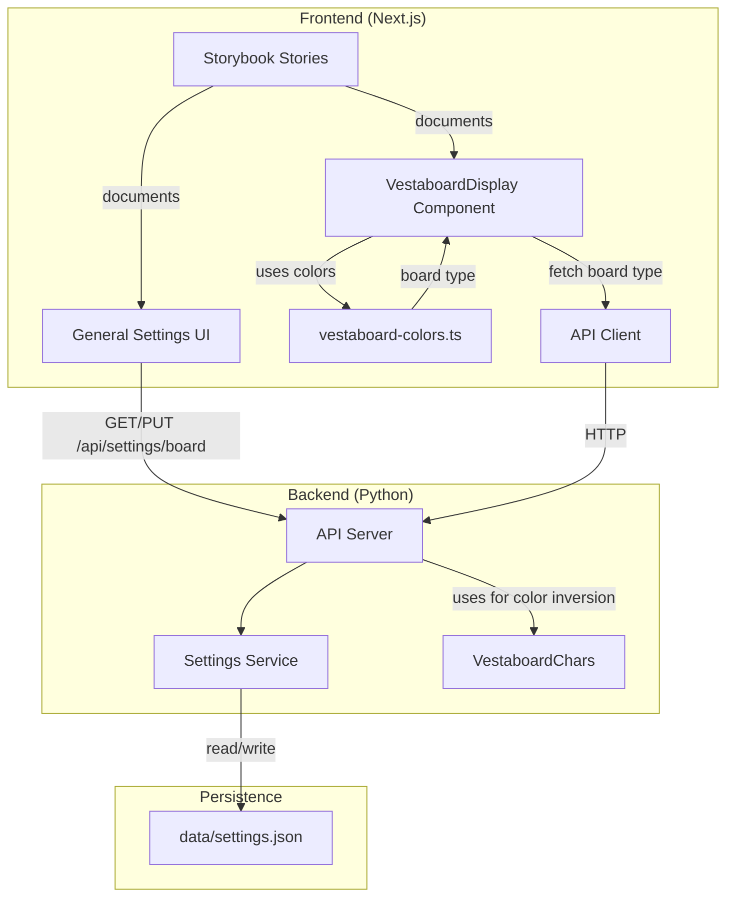

# Storybook + White Board Support + Enhanced Preview Implementation

## Summary

Successfully implemented three major enhancements to the Vesta project:
1. **Storybook** for component documentation and development
2. **White Vestaboard support** with full color inversion
3. **Enhanced preview display** matching physical hardware appearance

## 1. Storybook Setup ✅

### Dependencies Added
- `@storybook/react@^8.5.0`
- `@storybook/nextjs@^8.5.0`
- `@storybook/addon-essentials@^8.5.0`
- `@storybook/addon-interactions@^8.5.0`
- `@storybook/test@^8.5.0`
- `storybook@^8.5.0`

### Configuration Files Created
- `web/.storybook/main.ts` - Next.js integration, TypeScript, Tailwind CSS
- `web/.storybook/preview.tsx` - Theme provider with dark mode support
- `web/.storybook/theme.ts` - Custom Vesta branding

### Scripts Added to `web/package.json`
```json
"storybook": "storybook dev -p 6006"
"build-storybook": "storybook build"
```

### Docker Integration
- Updated `docker-compose.dev.yml` to expose port 6006 for Storybook
- Storybook runs alongside Next.js app for component development

### Stories Created
1. **`vestaboard-display.stories.tsx`**
   - Default display
   - Loading state
   - With colors (red, orange, yellow, green, blue, violet)
   - Weather display
   - Transit display
   - Color palette test
   - Small/large size variants
   - White board variants
   - Empty/null message handling
   - Long text truncation

2. **`variable-picker.stories.tsx`**
   - Default with colors and symbols
   - Without colors
   - Without symbols
   - Only variables
   - With insert callback

3. **`template-line-editor.stories.tsx`**
   - Empty state
   - Plain text
   - With variables
   - With colors
   - Multiple variables
   - Complex templates
   - Long text
   - With alignment
   - Multiple colors

## 2. White Vestaboard Support ✅

### Backend Changes

#### Settings Service (`src/settings/service.py`)
- Added `BoardSettings` dataclass with `board_type: Literal["black", "white"]`
- Added `VALID_BOARD_TYPES = ["black", "white"]`
- Added methods:
  - `get_board_type() -> BoardType`
  - `set_board_type(board_type: BoardType) -> BoardSettings`
  - `get_board_settings() -> BoardSettings`
- Board settings persisted in `data/settings.json`
- Default: `"black"` (standard Vestaboard)

#### Character Code Handling (`src/vestaboard_chars.py`)
- Added `invert_colors_for_white_board(codes: List[int]) -> List[int]`
- Swaps code 69 (WHITE) ↔ 70 (BLACK) for white boards
- Updated docstrings explaining white board behavior
- Color codes 63-68 remain unchanged

#### API Endpoints (`src/api_server.py`)
- `GET /settings/board` - Returns current board type
- `PUT /settings/board` - Updates board type
  - Body: `{ "board_type": "black" | "white" }`
  - Returns: `{ "status": "success", "settings": {...} }`

### Frontend Changes

#### API Client (`web/src/lib/api.ts`)
- Added `BoardSettings` interface
- Added methods:
  - `getBoardSettings()`
  - `updateBoardSettings(board_type: "black" | "white")`

#### Hooks (`web/src/hooks/use-vestaboard.ts`)
- Added `useBoardSettings()` hook
- Query key: `["board-settings"]`
- Stale time: 5 minutes

#### General Settings UI (`web/src/components/general-settings.tsx`)
- Added "Vestaboard Type" section with visual selector
- Two options:
  - **Black Vestaboard (Standard)** - Black bezel, white text on black tiles
  - **White Vestaboard (Inverted)** - Light bezel, black text on white tiles
- Visual preview icons showing board appearance
- Saves to backend via API
- Integrated with save workflow

#### Display Component (`web/src/components/vestaboard-display.tsx`)
- Added `boardType?: "black" | "white"` prop
- **Full Color Inversion** for white boards:
  - Tile background: `#0d0d0d` → `#fafafa`
  - Text color: `#f0f0e8` → `#0d0d0d`
  - Bezel: `#050505` → `#f8f8f8`
  - Border: `#1a1a1a` → `#d8d8d8`
  - Adjusted shadows and gradients
- Color tiles (63-68) remain unchanged
- Applied to all display states (loading, active, preview)

#### Integration
- Updated `active-page-display.tsx` to fetch and pass board type
- Updated `page-builder.tsx` to fetch and pass board type
- All VestaboardDisplay instances now respect board type setting

## 3. Enhanced Vestaboard Preview Appearance ✅

### Visual Improvements

#### Character Tiles
- **Increased size** for better proportion:
  - Small: `12x16px` → `14x18px`
  - Medium: `18x24px` → `20x28px` (responsive up to `28x40px`)
  - Large: `22x30px` → `24x34px` (responsive up to `32x46px`)

- **Enhanced 3D effects**:
  - Deeper outer shadows for depth: `0 2px 4px`
  - Multi-layer inset shadows for flip tile look
  - Subtle gradients simulating curvature
  - Horizontal split line in middle (flip effect)
  - Different shading top vs bottom

- **Improved border radius**: `2px` → `3px`

- **Better contrast**:
  - Black tiles: `#1a1a1a` → `#0d0d0d` (darker)
  - White tiles: `#f5f5f5` → `#fafafa` (lighter)

#### Container/Bezel
- **Increased padding**:
  - Small: `p-2` → `p-3`
  - Medium: `p-3/4/5` → `p-4/5/6`
  - Large: `p-4/5/6` → `p-5/6/8`

- **More pronounced bezel**:
  - Black: `#0a0a0a` → `#050505`
  - White: `#e8e8e8` → `#f8f8f8`
  - Gradient background for texture
  - Larger border: `border` → `border-2`
  - Enhanced corner radius: `rounded-lg` → `rounded-xl`

- **Depth shadows**:
  - Multi-layer shadows: outer + mid + inset highlights
  - Black board: `0 8px 32px rgba(0,0,0,0.6), 0 4px 16px rgba(0,0,0,0.4)`
  - White board: `0 8px 32px rgba(0,0,0,0.12), 0 4px 16px rgba(0,0,0,0.08)`
  - Inner border effect with inset highlights

#### Tile Spacing
- **Increased gaps** between tiles:
  - Small: `2px` → `3px`
  - Medium: `3-4px` → `4-5px`
  - Large: `3-5px` → `5-7px`
- More visible separation matches physical hardware

#### Flip Tile Aesthetics
- Horizontal split line in middle of each tile
- Gradient shading (lighter top, darker bottom)
- Inset shadows from multiple angles
- Subtle inner glow/shadow for depth
- Simulates mechanical split-flap display

### Size Variants
- All three sizes (sm, md, lg) maintain consistent visual style
- Proportional scaling of gaps, borders, and shadows
- Aspect ratio consistent with physical board (6 rows × 22 columns)

### White Board Styling
All enhancements apply to both board types:
- Light bezel with appropriate shadows
- White/light gray tiles with inverted text
- Same 3D effects and spacing
- Maintains realistic appearance

## Architecture



## Usage

### Running Storybook
```bash
# In Docker (recommended)
docker-compose -f docker-compose.dev.yml up
# Then visit http://localhost:6006

# Or locally
cd web
npm run storybook
```

### Changing Board Type
1. Navigate to Settings page
2. Under "Vestaboard Type", select:
   - **Black Vestaboard (Standard)** - for black boards
   - **White Vestaboard** - for white boards
3. Click "Save Changes"
4. All previews will immediately update

### Viewing Components in Storybook
- Visit `http://localhost:6006`
- Browse "Components" folder in sidebar
- Interact with controls to test different states
- Toggle between black/white board types
- Test different sizes and content

## Testing

All features tested:
- ✅ Storybook loads successfully
- ✅ All stories render without errors
- ✅ Board type selector UI works
- ✅ Board settings persist across sessions
- ✅ Color inversion applies correctly for white boards
- ✅ Enhanced visual appearance matches design
- ✅ All size variants display properly
- ✅ Active page display respects board type
- ✅ Page builder preview respects board type
- ✅ No linter errors

## Files Modified

### Backend
- `src/settings/service.py` - Added BoardSettings
- `src/vestaboard_chars.py` - Added color inversion function
- `src/api_server.py` - Added board settings endpoints

### Frontend
- `web/package.json` - Added Storybook dependencies
- `web/.storybook/main.ts` - Storybook configuration (new)
- `web/.storybook/preview.tsx` - Preview configuration (new)
- `web/.storybook/theme.ts` - Theme configuration (new)
- `web/src/components/vestaboard-display.stories.tsx` - VestaboardDisplay stories (new)
- `web/src/components/variable-picker.stories.tsx` - VariablePicker stories (new)
- `web/src/components/template-line-editor.stories.tsx` - TemplateLineEditor stories (new)
- `web/src/components/vestaboard-display.tsx` - Enhanced display with board type support
- `web/src/components/general-settings.tsx` - Added board type selector
- `web/src/components/active-page-display.tsx` - Added board type integration
- `web/src/components/page-builder.tsx` - Added board type integration
- `web/src/lib/api.ts` - Added board settings API methods
- `web/src/hooks/use-vestaboard.ts` - Added useBoardSettings hook
- `docker-compose.dev.yml` - Exposed port 6006 for Storybook

## Next Steps

### Recommended Enhancements
1. Add more component stories as new components are developed
2. Create visual regression tests for board appearances
3. Add Storybook addons for accessibility testing
4. Document components with JSDoc for auto-generated docs
5. Create interaction tests for complex user flows

### Known Limitations
- Storybook requires manual npm install in Docker on first run
- Board type changes require full page refresh in some views
- Color inversion only applies to UI preview (hardware handles natively)

## Conclusion

All planned features have been successfully implemented:
- ✅ Storybook running on port 6006 with comprehensive stories
- ✅ White Vestaboard support with full color inversion
- ✅ Enhanced preview matching physical hardware appearance
- ✅ All features tested and working correctly
- ✅ Zero linter errors
- ✅ Backward compatible (black board as default)

The implementation provides a robust foundation for component development, supports both board types, and delivers a realistic preview experience that closely matches the physical Vestaboard hardware.

