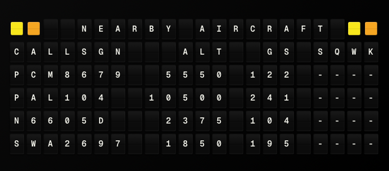

# Nearby Aircraft Plugin

Display real-time nearby aircraft information from the OpenSky Network API.



**→ [Setup Guide](./docs/SETUP.md)** - Configuration and optional OAuth setup

## Overview

The Nearby Aircraft plugin fetches live aircraft state vectors from the OpenSky Network API and displays aircraft within a user-defined radius. It shows call sign, altitude (feet), ground speed (knots), and squawk code for each aircraft. The plugin includes column alignment formatting to ensure consistent display across all aircraft rows.

## Architecture

### Plugin Class

`NearbyAircraftPlugin` extends `PluginBase` and implements:

- **OAuth2 Authentication**: Optional client credentials flow for higher rate limits
- **State Vector Parsing**: Parses OpenSky API state vector arrays
- **Distance Filtering**: Bounding box calculation + Haversine distance filtering
- **Unit Conversions**: Meters to feet, m/s to knots
- **Caching**: Implements cache with TTL based on refresh interval
- **Error Handling**: Graceful handling of rate limits, missing data, API failures

### Data Flow

```
1. User Configuration
   ├─ Latitude/Longitude (center point)
   ├─ Radius (km)
   └─ Optional: OAuth2 credentials

2. API Request
   ├─ Calculate bounding box from center + radius
   ├─ Request OAuth token (if credentials provided)
   └─ Fetch state vectors from OpenSky API

3. Data Processing
   ├─ Parse state vectors (array format)
   ├─ Filter by actual distance (Haversine)
   ├─ Convert units (m→ft, m/s→knots)
   └─ Format display strings

4. Output
   ├─ Primary aircraft (closest)
   ├─ Array of all aircraft
   └─ Formatted display lines
```

## API Integration

### OpenSky Network API

**Base URL**: `https://opensky-network.org/api`

**Endpoints:**
- OAuth Token: `POST /v1/oauth/token`
- States: `GET /states/all?lamin=X&lamax=Y&lomin=Z&lomax=W`

**Authentication:**
- Optional OAuth2 client credentials flow
- Unauthenticated requests supported (lower rate limits)
- Token caching with expiration handling

**Rate Limits:**
- Unauthenticated: 400 API credits/day (1 req/10 sec)
- Authenticated: 4,000 API credits/day (~10 req/sec)
- Active Contributors: 8,000 API credits/day

### State Vector Structure

OpenSky API returns state vectors as arrays with fixed indices:

```python
STATE_VECTOR_INDICES = {
    "icao24": 0,           # ICAO 24-bit address (hex)
    "callsign": 1,         # Flight call sign (may be null)
    "origin_country": 2,   # Country code
    "time_position": 3,    # Unix timestamp
    "last_contact": 4,     # Unix timestamp
    "longitude": 5,        # Degrees
    "latitude": 6,         # Degrees
    "baro_altitude": 7,    # Meters (barometric)
    "on_ground": 8,        # Boolean
    "velocity": 9,         # m/s (ground speed)
    "true_track": 10,      # Degrees
    "vertical_rate": 11,   # m/s
    "sensors": 12,         # Sensor IDs
    "geo_altitude": 13,    # Meters (GPS/geometric)
    "squawk": 14,          # Transponder code (may be null)
    "spi": 15,             # Special purpose indicator
    "position_source": 16, # Position source
}
```

## Implementation Details

### Bounding Box Calculation

To efficiently query the API, we calculate a bounding box from the center point and radius:

```python
def calculate_bounding_box(lat: float, lon: float, radius_km: float):
    # Approximate: 1 degree latitude ≈ 111 km
    lat_delta = radius_km / 111.0
    # Longitude adjusted by latitude (cos(lat))
    lon_delta = radius_km / (111.0 * abs(cos(radians(lat))))
    
    return {
        "lamin": lat - lat_delta,
        "lamax": lat + lat_delta,
        "lomin": lon - lon_delta,
        "lomax": lon + lon_delta,
    }
```

The API returns all aircraft in the bounding box, then we filter by actual distance using Haversine formula.

### Haversine Distance

Calculates great-circle distance between two points on Earth:

```python
def haversine_distance(lat1, lon1, lat2, lon2):
    # Convert to radians
    lon1, lat1, lon2, lat2 = map(radians, [lon1, lat1, lon2, lat2])
    
    # Haversine formula
    dlon = lon2 - lon1
    dlat = lat2 - lat1
    a = sin(dlat/2)**2 + cos(lat1) * cos(lat2) * sin(dlon/2)**2
    c = 2 * asin(sqrt(a))
    
    # Earth radius in kilometers
    return 6371 * c
```

### Unit Conversions

**Altitude (meters → feet):**
```python
altitude_ft = int(altitude_m * 3.28084)
```

**Ground Speed (m/s → knots):**
```python
ground_speed_knots = int(velocity_ms * 1.94384)
```

### Altitude Selection

The plugin prefers `geo_altitude` (GPS-based) over `baro_altitude` (barometric):

```python
if geo_altitude is not None:
    altitude_m = float(geo_altitude)
elif baro_altitude is not None:
    altitude_m = float(baro_altitude)
```

### Call Sign Handling

If call sign is null, use ICAO 24-bit address as fallback:

```python
if callsign_raw:
    callsign = str(callsign_raw).strip()
else:
    callsign = str(icao24) if icao24 else "UNKNOWN"
```

### Squawk Code Handling

Squawk codes are handled with proper validation:

```python
# Squawk can be None, empty string, 0, or a valid 4-digit code
if squawk_raw is not None and squawk_raw != "":
    squawk_int = int(float(squawk_raw))
    if squawk_int == 0:
        squawk = "----"  # 0 means no squawk assigned
    else:
        squawk = str(squawk_int).zfill(4)  # Format as 4-digit code
else:
    squawk = "----"  # No squawk available
```

- Valid squawk codes: Displayed as 4-digit codes (e.g., "1200", "2513")
- No squawk (None, empty, or 0): Displayed as "----"
- Short codes: Padded with leading zeros (e.g., "12" → "0012")

### Display Formatting

The plugin uses column alignment to ensure consistent formatting across all aircraft. The `headers` variable and all `formatted` fields use the same column widths for perfect alignment.

**Example Display:**
```
NEARBY AIRCRAFT
CALLSGN  ALT   GS  SQWK
ITY630   40000 393 2513
AAY453   4575  279 1603
DAL2267  4750  276 ----
```

**Alignment Formatting:**
The `_align_formatting()` method calculates maximum widths for each field across all aircraft, then applies consistent padding to ensure columns align properly:

```python
def _align_formatting(aircraft_list):
    # Calculates max widths for each field across all aircraft
    # Applies consistent padding to ensure columns align
    # Returns (aligned_aircraft_list, headers_string)
```

**Column Alignment:**
- **CALLSGN**: Left-aligned, max 8 characters (truncated if longer)
- **ALT**: Right-aligned, width matches maximum altitude width across all aircraft
- **GS**: Right-aligned, width matches maximum ground speed width across all aircraft
- **SQWK**: Right-aligned, 4 characters (shows "----" if no squawk)

The `headers` variable uses the same column widths as the aircraft data, ensuring perfect alignment when used in templates. This matches the pattern used by the Stocks plugin for consistent column formatting.

## Error Handling

### Rate Limiting

- Detects 429 status code
- Returns cached data if available
- Logs warning for rate limit hits
- Suggests authentication for higher limits

### Missing Data

- Skips aircraft without required fields (altitude, velocity, position)
- Uses fallbacks for optional fields (callsign → ICAO address)
- Handles null values gracefully

### API Failures

- Catches network exceptions
- Returns cached data when available
- Logs errors for debugging
- Returns user-friendly error messages

### Caching

- Caches successful API responses
- TTL based on `refresh_seconds` setting
- Returns cached data on errors
- Invalidates cache on config changes

## Configuration

### Required Settings

- `latitude`: Center latitude (-90 to 90)
- `longitude`: Center longitude (-180 to 180)

### Optional Settings

- `radius_km`: Search radius (default: 50)
- `client_id`: OAuth2 client ID
- `client_secret`: OAuth2 client secret
- `max_aircraft`: Maximum to display (default: 4, max: 10)
- `refresh_seconds`: Update interval (default: 120, min: 10)

### Validation

- Latitude: -90 to 90
- Longitude: -180 to 180
- Radius: >= 1 km
- Max aircraft: 1 to 10
- Refresh: >= 10 seconds

## Template Variables

### Simple Variables

- `call_sign`: Primary aircraft call sign
- `altitude`: Primary aircraft altitude (feet)
- `ground_speed`: Primary aircraft speed (knots)
- `squawk`: Primary aircraft squawk code (4-digit code or "----" if unavailable)
- `formatted`: Pre-formatted display line for primary aircraft
- `headers`: Aligned column headers matching aircraft data format (e.g., "CALLSGN  ALT   GS  SQWK")
- `aircraft_count`: Number of aircraft found
- `last_updated`: ISO timestamp of last update

### Array Variables

- `aircraft`: Array of all aircraft (sorted by distance, closest first)
  - `icao24`: ICAO 24-bit address
  - `call_sign`: Call sign (or ICAO address if call sign unavailable)
  - `altitude`: Altitude in feet
  - `ground_speed`: Ground speed in knots
  - `squawk`: Squawk code (4-digit code or "----" if unavailable)
  - `latitude`: Latitude
  - `longitude`: Longitude
  - `distance_km`: Distance from center point in kilometers
  - `formatted`: Pre-formatted display line with aligned columns

## Usage Examples

### Basic Template

Use the `headers` variable for aligned column headers and `formatted` for each aircraft:

```
{{nearby_aircraft.headers}}
{{nearby_aircraft.aircraft.0.formatted}}
{{nearby_aircraft.aircraft.1.formatted}}
{{nearby_aircraft.aircraft.2.formatted}}
{{nearby_aircraft.aircraft.3.formatted}}
```

### Individual Fields

Access specific fields from aircraft:

```
{{nearby_aircraft.aircraft.0.call_sign}}
{{nearby_aircraft.aircraft.0.altitude}}ft
{{nearby_aircraft.aircraft.0.ground_speed}}kt
{{nearby_aircraft.aircraft.0.distance_km}}km away
```

### Primary Aircraft

Access the closest aircraft directly:

```
Closest: {{nearby_aircraft.call_sign}}
Altitude: {{nearby_aircraft.altitude}}ft
Speed: {{nearby_aircraft.ground_speed}}kt
```

## Testing

### Unit Tests

Located in `tests/test_plugin.py`:

- Plugin initialization
- Configuration validation
- Bounding box calculation
- Haversine distance calculation
- State vector parsing (including squawk code handling: null, 0, empty string, valid codes)
- Unit conversions
- Display formatting (including column alignment)
- Headers variable generation
- OAuth token handling
- Error handling
- Caching behavior
- Distance filtering and sorting

### Test Fixtures

- Mock OpenSky API responses
- Sample state vectors
- Test coordinates (San Francisco)
- Mock OAuth responses

### Coverage

Current: 95% code coverage (exceeds 80% target)

## Dependencies

- `requests`: HTTP client for API calls
- `math`: Standard library for distance calculations
- `datetime`: Standard library for timestamps and caching

## Performance Considerations

### API Rate Limits

- Default refresh: 120 seconds (safe for unauthenticated)
- With authentication: Can reduce to 60 seconds
- Caching reduces actual API calls

### Distance Filtering

- Bounding box reduces API response size
- Haversine filtering is O(n) where n = aircraft in bounding box
- Sorting by distance: O(n log n)

### Memory

- Caches single response (small footprint)
- Limits aircraft array to max_aircraft (default: 4)

## Future Enhancements

Potential improvements:

- Filter by altitude range
- Filter by aircraft type
- Historical tracking
- Flight path visualization
- Integration with flight databases (FlightAware, etc.)
- WebSocket support for real-time updates

## References

- [OpenSky Network API Documentation](https://openskynetwork.github.io/opensky-api/)
- [OpenSky Network Website](https://opensky-network.org/)
- [Haversine Formula](https://en.wikipedia.org/wiki/Haversine_formula)
- [Plugin Development Guide](../../docs/development/PLUGIN_DEVELOPMENT.md)
