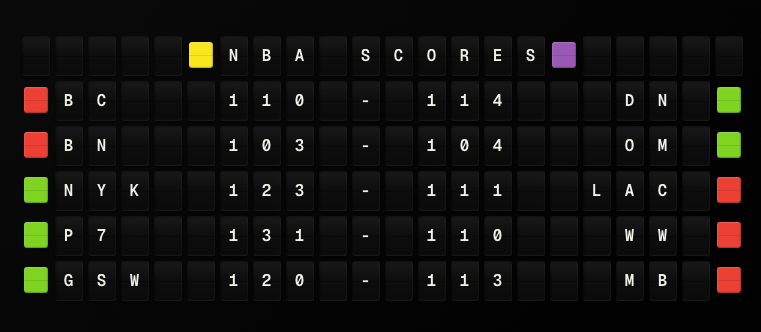

# Sports Scores Plugin

Display recent sports match scores from NFL, Soccer, NHL, and NBA using TheSportsDB API.

**→ [Setup Guide](./docs/SETUP.md)** - Configuration and optional API key setup

## Overview

The Sports Scores plugin fetches recent sports match scores from TheSportsDB API and exposes them as template variables for use in FiestaBoard displays. The plugin supports multiple sports simultaneously and can work with the free tier API or an optional premium API key.

## Features

- Support for 4 sports: NFL, Soccer, NHL, NBA
- Fetch recent completed and live games
- Optional API key for premium features
- Configurable number of games per sport
- Automatic formatting for board display with aligned scores
- Color-coded team status (winning/losing/tied/no scores)
- Array-based variable access for multiple games
- Intelligent team name abbreviation for optimal display

## Architecture

The plugin follows the standard FiestaBoard plugin architecture:

- Inherits from `PluginBase` in `src/plugins/base.py`
- Configuration via `manifest.json`
- Template variables exposed through the plugin system
- Error handling and graceful degradation

## API Integration

### TheSportsDB API

The plugin uses TheSportsDB V1 API for fetching sports events:

- **Base URL**: `https://www.thesportsdb.com/api/v1/json/{api_key}/`
- **Free Tier**: Uses API key "123" by default
- **Premium**: Optional API key for higher rate limits and live scores

### Endpoints Used

- `searchevents.php` - Search for events by sport
  - Parameters: `s` (sport identifier)

### Sport Mapping

The plugin maps user-friendly sport names to TheSportsDB identifiers:

- `NFL` → `American%20Football`
- `Soccer` → `Soccer`
- `NHL` → `Ice%20Hockey`
- `NBA` → `Basketball`

## Screenshot



*Example display showing NBA scores with color-coded team status indicators*

## Data Structure

The plugin returns data in the following structure:

```python
{
    "sport_count": 2,           # Number of sports selected
    "game_count": 5,            # Total number of games
    "last_updated": "2024-01-15T10:30:00Z",
    
    # Primary game (first game)
    "sport": "NFL",
    "team1": "Patriots",
    "team2": "Bills",
    "score1": 24,
    "score2": 17,
    "status": "Match Finished",
    "date": "2024-01-15",
    "time": "20:00",
    "formatted": "Patriots 24 - 17 Bills",
    
    # Array of all games
    "games": [
        {
            "sport": "NFL",
            "team1": "Patriots",
            "team2": "Bills",
            "team1_full": "New England Patriots",
            "team2_full": "Buffalo Bills",
            "team1_color": "{66}",      # Color code: GREEN if winning, RED if losing, YELLOW if tied, BLUE if no scores
            "team2_color": "{63}",      # Color code: GREEN if winning, RED if losing, YELLOW if tied, BLUE if no scores
            "score1": 24,
            "score2": 17,
            "status": "Match Finished",
            "date": "2024-01-15",
            "time": "20:00",
            "formatted": "Patriots 24 - 17 Bills"  # Exactly 20 characters (designed for use with color tiles)
        },
        ...
    ]
}
```

## Implementation Details

### Event Parsing

The `_parse_event()` method processes events from TheSportsDB API:

1. Extracts team names (home and away)
2. Handles missing scores (scheduled games) - uses "? - ?" format
3. Determines team colors based on game status:
   - **GREEN ({66})**: Winning team
   - **RED ({63})**: Losing team
   - **YELLOW ({65})**: Tied game (both teams have same score > 0)
   - **BLUE ({67})**: No scores yet (0-0)
4. Formats display strings (exactly 20 chars for use with color tiles)
5. Intelligently abbreviates team names (removes spaces, applies common abbreviations)
6. Aligns scores vertically for readability
7. Returns structured game data with color codes

### Error Handling

The plugin handles various error conditions:

- **Rate Limits (429)**: Logs warning and returns empty games for that sport
- **Network Errors**: Catches exceptions and returns error in PluginResult
- **Empty Responses**: Handles gracefully, returns "No games found" error
- **Invalid Events**: Skips events with missing team names

### Caching

The plugin maintains a cache of the last fetched data for use in `get_formatted_display()`. The cache is updated on each successful `fetch_data()` call.

## Configuration

### Settings Schema

- `enabled`: Enable/disable the plugin
- `sports`: Array of selected sports (min 1)
- `api_key`: Optional TheSportsDB API key
- `max_games_per_sport`: Max games to fetch per sport (1-10, default 3)
- `refresh_seconds`: Refresh interval (min 60, default 300)

### Environment Variables

- `SPORTS_SCORES_ENABLED`: Enable plugin
- `SPORTS_SCORES_API_KEY`: Optional API key
- `SPORTS_SCORES_SPORTS`: Comma-separated sports list
- `SPORTS_SCORES_MAX_GAMES`: Max games per sport

## Template Variables

### Simple Variables

- `sport` - Primary game sport
- `team1` - Primary game team 1 (truncated)
- `team2` - Primary game team 2 (truncated)
- `score1` - Primary game score 1
- `score2` - Primary game score 2
- `status` - Primary game status
- `date` - Primary game date
- `time` - Primary game time
- `formatted` - Primary game formatted string
- `sport_count` - Number of sports selected
- `game_count` - Total number of games
- `last_updated` - Last update timestamp

### Array Variables

- `games` - Array of all games
  - Access via `{{sports_scores.games.0.team1}}`, `{{sports_scores.games.1.formatted}}`, etc.
  - Each game has: `sport`, `team1`, `team2`, `team1_full`, `team2_full`, `team1_color`, `team2_color`, `score1`, `score2`, `status`, `date`, `time`, `formatted`

### Color Variables

The plugin provides color-coded status indicators for each team:

- `team1_color` - Color code for team 1 (home team)
- `team2_color` - Color code for team 2 (away team)

**Color Codes:**
- `{66}` = **GREEN** - Team is winning
- `{63}` = **RED** - Team is losing
- `{65}` = **YELLOW** - Game is tied (both teams have same score > 0)
- `{67}` = **BLUE** - No scores yet (game hasn't started)

**Usage Example:**
```
{{sports_scores.games.0.team1_color}}{{sports_scores.games.0.formatted}}{{sports_scores.games.0.team2_color}}
```

This will display a color tile before team 1, the formatted game string (20 chars), and a color tile after team 2, for a total of 22 characters (full board width).

**Note:** The `formatted` string is designed to be exactly 20 characters to account for the 2 color tiles (1 before + 1 after = 2 tiles), ensuring perfect alignment and full-width display.

## Testing

The plugin includes comprehensive tests with >80% coverage:

- Config validation tests
- API integration tests (mocked)
- Error handling tests
- Edge case tests
- Data structure validation

Run tests with:

```bash
python scripts/run_plugin_tests.py --plugin=sports_scores
```

## Development Notes

### Adding New Sports

To add support for additional sports:

1. Add sport mapping to `SPORT_MAP` in `__init__.py`
2. Add sport to enum in `manifest.json` settings schema
3. Update documentation

### API Rate Limits

The free tier has rate limits (30 requests/minute). The plugin handles 429 responses gracefully by logging warnings and continuing with other sports.

### Team Name Abbreviation

Team names are intelligently abbreviated for optimal display:

- **Space Removal**: All spaces are removed from abbreviated names (e.g., "Real Sociedad" → "RSoc")
- **Common Abbreviations**: The plugin applies common abbreviations (e.g., "United" → "Utd", "Sociedad" → "Soc")
- **Prefix Handling**: Common prefixes like "FC", "AC" are preserved and the rest is abbreviated
- **Acronym Fallback**: For multi-word teams, creates acronyms from first letters when appropriate
- **Fixed-Width Formatting**: Team names are padded to ensure scores align vertically across all games

The `formatted` string uses abbreviated team names and is exactly 20 characters, designed to work with color tiles for a total width of 22 characters (full board width).

Full team names are preserved in `team1_full` and `team2_full` variables.

## Author

FiestaBoard Team
