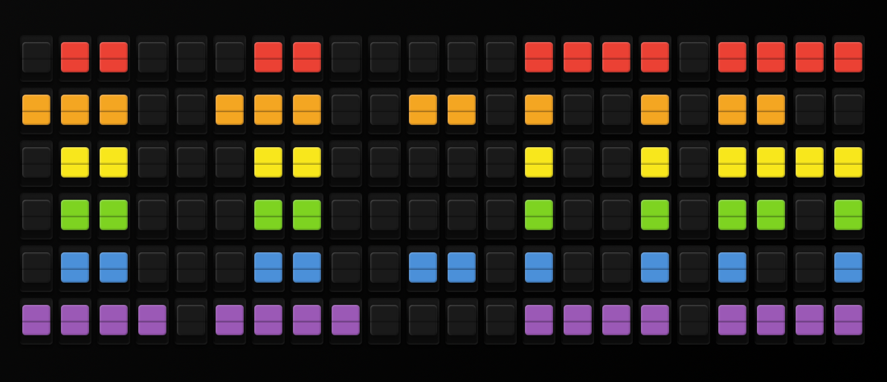

# Visual Clock Plugin

Displays a full-screen clock with large pixel-art style digits that span the entire 6x22 FiestaBoard display.



**→ [Setup Guide](./docs/SETUP.md)** - Configuration and API key setup

## Features

- Full-screen display using colored tiles
- Large, easy-to-read digits (6 rows tall)
- 12-hour or 24-hour time format
- Multiple color patterns (Pride, Rainbow, Sunset, Ocean, Retro, Christmas, Halloween)
- Customizable digit and background colors (solid pattern)
- Timezone support

## Configuration

| Setting | Type | Default | Description |
|---------|------|---------|-------------|
| `timezone` | string | `America/Los_Angeles` | IANA timezone (e.g., `Europe/London`, `Asia/Tokyo`) |
| `time_format` | string | `12h` | Time format: `12h` or `24h` |
| `color_pattern` | string | `solid` | Color pattern (see below) |
| `digit_color` | string | `white` | Color for solid pattern: `red`, `orange`, `yellow`, `green`, `blue`, `violet`, `white` |
| `background_color` | string | `black` | Background color: `red`, `orange`, `yellow`, `green`, `blue`, `violet`, `white`, `black` |

## Color Patterns

| Pattern | Description |
|---------|-------------|
| `solid` | Single color (uses digit_color setting) |
| `pride` | Rainbow rows - each row is a different color (red, orange, yellow, green, blue, violet) |
| `rainbow` | Rainbow digits - each digit is a different color (red, orange, yellow, green, blue, violet) |
| `sunset` | Warm gradient - red at top fading to yellow at bottom |
| `ocean` | Cool gradient - blue at top through green to violet at bottom |
| `retro` | Classic amber LED look - orange and yellow tones |
| `christmas` | Festive - alternating red and green digits |
| `halloween` | Spooky - alternating orange and violet digits |

## Template Variables

| Variable | Description | Example |
|----------|-------------|---------|
| `visual_clock` | Full clock display as string with color markers | `{yellow}{black}...` |
| `time` | Current time as text | `12:34 PM` or `14:34` |
| `time_format` | Current time format setting | `12h` or `24h` |
| `hour` | Current hour | `12` |
| `minute` | Current minute (zero-padded) | `05` |

## Display Layout

The clock uses pixel-art style digits that fill the entire board:

```
Rows 0-5: [H1][gap][H2][gap][:][gap][M1][gap][M2]
```

- Each digit is 4 columns wide × 6 rows tall (full board height)
- Colon separator is 2 columns wide × 6 rows tall
- 1-column gaps on both sides of colon for clear separation
- Total layout: 4 + 1 + 4 + 1 + 2 + 1 + 4 + 1 + 4 = 22 columns

## Usage

### As a Single Plugin Display

Configure a page to use the `visual_clock` plugin with "single" display type. The full-screen clock will be rendered automatically.

### Using Template Variables

You can also use the template variables in custom templates:

```
{{visual_clock.time}}
```

## Development

### Running Tests

```bash
python scripts/run_plugin_tests.py --plugin=visual_clock
```

### Dependencies

- `pytz` - Timezone handling (included in FiestaBoard core)

## License

MIT License - see the main FiestaBoard LICENSE file.
