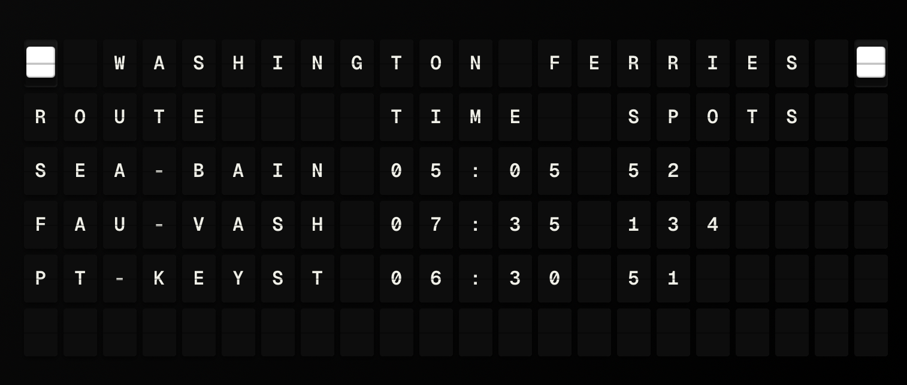

# WSDOT Plugin

Washington State Department of Transportation integration for FiestaBoard. This plugin currently supports **Washington State Ferries (WSF)**: today's schedules, vessel names, car spots remaining, terminal wait times, and service alerts.

## Features

- **Scheduled departure times** for the day (both directions per route)
- **Actual departure times** when provided by the API (most recent departures)
- **Vessel names** (e.g. Wenatchee, Tacoma) on each sailing
- **Car spots remaining** for upcoming sailings (from Terminals API)
- **Terminal wait times** where available
- **Alerts** (service disruptions, breakdowns, etc.)

## APIs Used

All data comes from the [WSDOT Traveler Information API](https://www.wsdot.wa.gov/traffic/api/) and WSF REST services:

- **WSF Schedule API** – `scheduletoday/{RouteID}/{OnlyRemainingTimes}` for today's sailings
- **WSF Terminals API** – `terminalsailingspace`, `terminalwaittimes`
- **WSF Vessels API** – `vesselbasics` for vessel ID → name mapping
- **WSF Schedule API** – `alerts` for service alerts

A free API Access Code is required (register at the link above).

## Configuration

- **api_access_code** (required): WSDOT API access code from free registration
- **routes** (required): List of up to 4 objects with `route_id` (integer). See [docs/SETUP.md](docs/SETUP.md) for route IDs.
- **refresh_seconds** (optional, default 120): How often to refresh data (minimum 60)

## Template Variables

| Variable | Description |
|----------|-------------|
| `formatted` | One-line summary (first route) |
| `route_count` | Number of routes configured |
| `has_alerts` | Whether any alerts are active |
| `routes` | Array of route objects (see below) |
| `alerts` | Array of alert objects (`headline`, `alert_text`) |

Each item in `routes` has:

- `route_name`, `route_id`, `formatted`
- `departures_ab` – list of departures (direction A→B): `scheduled_time`, `actual_time`, `vessel_name`, `spots_remaining`
- `departures_ba` – list of departures (direction B→A), same fields
- `wait_time_minutes` – terminal wait when available
- `alerts` – route-specific alerts if any

## Implementation Notes

- The plugin uses `Accept: application/json` and parses both PascalCase and camelCase keys from the WSF APIs.
- Vessel names and terminal data are cached for the lifetime of the plugin instance to reduce API calls.
- If a route returns no data, that route is still included with empty departures and "No data" formatted line; other routes are still returned (partial success).

## Screenshot

## Future

The plugin is named "WSDOT" to allow adding other WSDOT data later (e.g. Mountain Pass conditions, Travel Times, Highway Alerts) using the same API access code.
